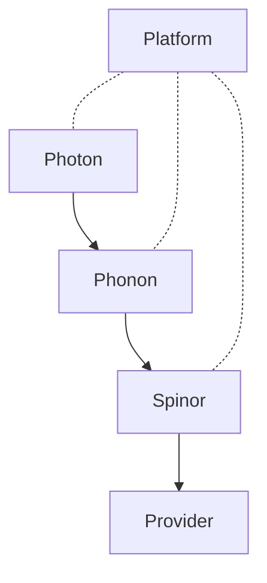

# Heisenberg Quantum Stack

> A four-layer quantum compiler — **Photon · Phonon · Spinor** —
> plus a single-command launcher and a browser playground. Write a
> quantum program once; run it on any of **27 chips**.

[](https://nimesh08.github.io/quantum-stack/)
[](https://github.com/nimesh08/quantum-stack/actions/workflows/ci.yml)
[](https://github.com/nimesh08/quantum-stack/actions/workflows/docs.yml)
[](LICENSE)

Heisenberg, Spinor, Phonon and Photon were designed and implemented
by **Nimesh Cheedella**.

---

## Where to look

| Want to know ... | Read |
|------------------|------|
| Where Heisenberg is going | [Vision](https://nimesh08.github.io/quantum-stack/vision/) |
| What we are building right now | [Current plan](https://nimesh08.github.io/quantum-stack/plan/) |
| What has shipped so far | [Progress](https://nimesh08.github.io/quantum-stack/progress/) |
| The source code | [github.com/nimesh08/quantum-stack](https://github.com/nimesh08/quantum-stack) |

---

## What you get

| Layer | What it is |
|-------|------------|
| **Photon** | Object-oriented user-facing language. Three frontends: `.pho` source, `@photon.kernel` Python decorator, `[[photon::kernel]]` C++ attribute. All three converge on the same C++ engine. |
| **Phonon** | Structured IR with linear types (no-cloning enforced at compile time) and the optimizer pipeline (cancellation, rotation merging, ZX, scheduling). |
| **Spinor** | Chip-locked assembly. Placement, SABRE routing, KAK + Euler-ZYZ decomposition, OpenQASM 3 / QIR / Quil emit. |
| **Provider** | Verbatim submission to IBM, AWS Braket, Azure Quantum, plus four cassette-only adapters for QCI, Anyon, TII, and Alice and Bob. |
| **Platform** | `heisenberg run` launcher, FastAPI jobsvc, queue worker, calibration scheduler, React 19.2 + Monaco playground. |



## Try it in 30 seconds

```bash
pip install heisenberg
heisenberg init      # creates ~/.local/share/heisenberg/, runs migrations
heisenberg seed      # creates admin@local with default API key
heisenberg run       # starts everything; opens http://127.0.0.1:8080/
```

Click **Run** in the playground. Within a second you see a
`00 / 11` histogram — the Bell pair, compiled through every layer,
submitted in cassette mode, returned to the editor.

The full quickstart:
<https://nimesh08.github.io/quantum-stack/quickstart/>.

## Three SDKs, one engine

| Pick ... | When ... | Quickstart |
|----------|----------|------------|
| **Python** | data-science / ML code, fastest path to histogram | [`sdks/python/quickstart`](https://nimesh08.github.io/quantum-stack/sdks/python/quickstart/) |
| **C++** | embed Heisenberg inside a high-performance app | [`sdks/cpp/quickstart`](https://nimesh08.github.io/quantum-stack/sdks/cpp/quickstart/) |
| **TypeScript** | build your own UI on top of `jobsvc` | [`sdks/typescript/quickstart`](https://nimesh08.github.io/quantum-stack/sdks/typescript/quickstart/) |
| **REST** | drive Heisenberg from anything that speaks HTTP | [`sdks/rest`](https://nimesh08.github.io/quantum-stack/sdks/rest/) |

## Production install (systemd)

```bash
# Create the service user, install heisenberg into a dedicated venv,
# drop the chip registry, configure /etc/heisenberg/heisenberg.env,
# and enable the three units.
sudo useradd --system --home /var/lib/heisenberg \
             --shell /usr/sbin/nologin heisenberg
sudo install -d -o heisenberg -g heisenberg /opt/heisenberg /var/lib/heisenberg /etc/heisenberg
sudo -u heisenberg python3 -m venv /opt/heisenberg/venv
sudo -u heisenberg /opt/heisenberg/venv/bin/pip install heisenberg

# Copy the systemd units and config example.
sudo install -m 644 platform/systemd/*.service /etc/systemd/system/
sudo install -m 640 platform/systemd/heisenberg.env.example /etc/heisenberg/heisenberg.env

sudo systemctl daemon-reload
sudo systemctl enable --now heisenberg-jobsvc heisenberg-worker heisenberg-calibration
```

Full server runbook:
<https://nimesh08.github.io/quantum-stack/operations/native_systemd/>.

## Repository layout

```
quantum-stack/
├── CMakeLists.txt          # top-level C++ build (LLVM/MLIR)
├── cmake/Versions.cmake    # pinned third-party versions
├── spinor/                 # chip-locking compiler (C++)
├── phonon/                 # IR + optimizer (C++)
├── photon/                 # OO front-end + nanobind (C++/Python)
├── platform/               # jobsvc · worker · calibration · playground · launcher
│   ├── jobsvc/
│   ├── calibration/
│   ├── playground/
│   ├── launcher/
│   └── systemd/
├── docs/
│   ├── site/               # MkDocs Material — published to GitHub Pages
│   └── archive/            # historical build journals (verbatim)
├── scripts/                # docs lint, cursor scrub, chip generators
└── .github/workflows/
```

## The seven critical rules

> 1. **Build bottom-up.** Spinor → Phonon → Photon → Platform.
> 2. **Optimization lives in Phonon, never in Spinor.**
> 3. **One C++ engine, one source of truth.**
> 4. **Re-verify and pin every version before coding.**
> 5. **Submit to providers in verbatim / pass-through mode only.**
> 6. **Phase E (auto-synthesis) is out of scope.**
> 7. **Photon, Phonon, Spinor are working names; trademark search before public use.**

The full rationale lives at
<https://nimesh08.github.io/quantum-stack/internals/seven_rules/>.

## Pinned versions (re-verified 2026-06-16)

| Component | Pin |
|---|---|
| LLVM / MLIR | 22.1.8 |
| C++ | C++20 |
| Eigen | 5.0.1 |
| nanobind | 2.12.0 |
| FastAPI | 0.137.1 |
| PostgreSQL (optional) | 17.10 |
| React | 19.2.7 |
| `@monaco-editor/react` | ^4.7.0 |
| MkDocs Material | 9.7.6 |

Authoritative pins live in
[`cmake/Versions.cmake`](cmake/Versions.cmake),
[`platform/jobsvc/pyproject.toml`](platform/jobsvc/pyproject.toml),
and
[`platform/playground/package.json`](platform/playground/package.json).

## Documentation

<https://nimesh08.github.io/quantum-stack/> — landing page,
quickstart, three-language SDKs, three-language tutorials, full
REST reference (Redoc), full Python reference (mkdocstrings), full
C++ reference (Doxygen), full TypeScript reference (TypeDoc),
operations runbook, internals.

## Contributing

See [`CONTRIBUTING.md`](CONTRIBUTING.md) for the dev setup and PR
conventions, and [`CODE_OF_CONDUCT.md`](CODE_OF_CONDUCT.md) for the
community standards.

Security disclosures: please follow [`SECURITY.md`](SECURITY.md).

## License

[Apache License 2.0](LICENSE). The trademarks "Photon", "Phonon",
and "Spinor" are working names; please check trademark status
before using them in derivative projects (RULE 7).

---

Heisenberg, Spinor, Phonon and Photon were designed and implemented
by **Nimesh Cheedella** — <chnimesh0808@gmail.com> ·
[github.com/nimesh08](https://github.com/nimesh08).
