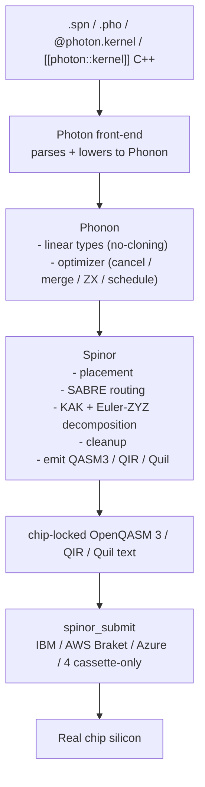

# Heisenberg Quantum Stack — compiler

> A four-layer quantum compiler — **Photon · Phonon · Spinor** —
> packaged for Python and shipped as signed binaries. Write a
> quantum program once; compile it for any of 27 chips.

[](https://nimesh08.github.io/quantum-stack/)
[](https://github.com/nimesh08/quantum-stack/actions/workflows/release.yml)
[](https://github.com/nimesh08/quantum-stack/actions/workflows/docs.yml)
[](LICENSE)

> [!IMPORTANT]
> **This repo is the compiler.** The product layer (a FastAPI
> service, the calibration scheduler, the React + Monaco playground,
> the `heisenberg run` launcher) lives at
> [github.com/nimesh08/heisenberg-platform](https://github.com/nimesh08/heisenberg-platform)
> and consumes this repo's PyPI wheels.

Heisenberg, Spinor, Phonon and Photon were designed and implemented
by **Nimesh Cheedella**.

---

## Where to look

| Want to know ... | Read |
|---|---|
| Where Heisenberg is going | [Vision](https://nimesh08.github.io/quantum-stack/vision/) |
| What we are building right now | [Current plan](https://nimesh08.github.io/quantum-stack/plan/) |
| What has shipped so far | [Progress](https://nimesh08.github.io/quantum-stack/progress/) |
| The product layer (FastAPI / launcher / playground) | [github.com/nimesh08/heisenberg-platform](https://github.com/nimesh08/heisenberg-platform) |

---

## What this repo ships

| Artefact | What it is |
|---|---|
| **`heisenberg-photon`** (PyPI wheel) | The compiler engine + Python facade. Bundles `photon._engine`, the chip registry, and the `spinorc` + `photonc` CLI binaries (which land on `$PATH` after `pip install`). |
| **`heisenberg-spinor-submit`** (PyPI wheel) | Provider adapters: IBM, AWS Braket, Azure Quantum, plus four cassette-only adapters. Verbatim submission only (RULE 5). |
| Signed CLI binaries on GitHub Releases | `spinorc`, `phononc`, `photonc`, `photonc-cxx` for linux-x86_64, linux-arm64, darwin-arm64. Cosign keyless + syft SBOM. |
| C++ libraries (`cmake --install`) | `libspinor`, `libphonon`, `libphoton` + headers. Use when embedding the engine in your own C++ app. |

The full contract — pin policy, ABI promise, distribution channels —
is in [INTEGRATION.md](INTEGRATION.md).

## Try it in 30 seconds

```bash
pip install heisenberg-photon
```

Write a Bell pair in Spinor:

```spinor
target generic
qubit q[2]
bit c[2]
h q[0]
cx q[0], q[1]
c = measure q
```

Compile it for IBM Heron r2:

```bash
spinorc compile -t ibm_heron_r2 bell.spn
```

Or write the same program in Photon (the OO language) from a Python
script:

```python
from photon import kernel, compile_phonon

@kernel
def bell() -> bit[2]:
    q = QReg(2)
    q.h(0)
    q.cx(0, 1)
    return q.measure()
```

The full quickstart:
<https://nimesh08.github.io/quantum-stack/quickstart/>.

## Architecture



Three input languages, one C++ engine, one chip-locked artefact, one
verbatim-mode adapter layer. Every reader who lands on this repo
should be able to follow that arrow.

For deeper explanation:
[Architecture](https://nimesh08.github.io/quantum-stack/internals/architecture/),
the [seven critical rules](https://nimesh08.github.io/quantum-stack/internals/seven_rules/),
the [decisions log](https://nimesh08.github.io/quantum-stack/internals/decisions/).

## Build from source

```bash
git clone https://github.com/nimesh08/quantum-stack.git
cd quantum-stack
cmake -B build -GNinja \
  -DLLVM_DIR=$(llvm-config-22 --cmakedir) \
  -DMLIR_DIR=$(llvm-config-22 --cmakedir)/../mlir
cmake --build build -j
ctest --test-dir build --output-on-failure
```

Pinned versions live in [`cmake/Versions.cmake`](cmake/Versions.cmake)
(LLVM/MLIR 22.1.8, Eigen 5.0.1, nanobind 2.12.0, C++20).

## Repository layout

```
quantum-stack/
├── CMakeLists.txt          # top-level C++ build (LLVM/MLIR)
├── cmake/Versions.cmake    # pinned third-party versions
├── spinor/                 # chip-locking compiler (C++)
├── phonon/                 # IR + optimizer (C++)
├── photon/                 # OO front-end + nanobind (C++/Python)
│   └── bindings/python/    # heisenberg-photon wheel build (scikit-build-core)
├── docs/
│   ├── site/               # MkDocs Material — published to GitHub Pages
│   └── archive/            # historical build journals (verbatim)
├── scripts/                # docs lint, cursor scrub, chip generators
└── .github/workflows/
```

## The seven critical rules

> 1. **Build bottom-up.** Spinor → Phonon → Photon.
> 2. **Optimization lives in Phonon, never in Spinor.**
> 3. **One C++ engine, one source of truth.**
> 4. **Re-verify and pin every version before coding.**
> 5. **Submit to providers in verbatim / pass-through mode only.**
> 6. **Auto-synthesis is out of scope.**
> 7. **Photon, Phonon, Spinor are working names; trademark search before public use.**

Full rationale at
<https://nimesh08.github.io/quantum-stack/internals/seven_rules/>.

## Documentation

<https://nimesh08.github.io/quantum-stack/> — landing page,
quickstart, three Languages refs, three SDKs (Python via
mkdocstrings, C++ via Doxygen, REST is in the platform repo's docs),
internals, future plan, vision/plan/progress.

## Contributing

See [`CONTRIBUTING.md`](CONTRIBUTING.md) for the dev setup and PR
conventions, and [`CODE_OF_CONDUCT.md`](CODE_OF_CONDUCT.md) for the
community standards.

Security disclosures: please follow [`SECURITY.md`](SECURITY.md).

## License

[Apache License 2.0](LICENSE). The trademarks "Photon", "Phonon",
and "Spinor" are working names; please check trademark status
before using them in derivative projects (RULE 7).

---

Heisenberg, Spinor, Phonon and Photon were designed and implemented
by **Nimesh Cheedella** — <chnimesh0808@gmail.com> ·
[github.com/nimesh08](https://github.com/nimesh08).
