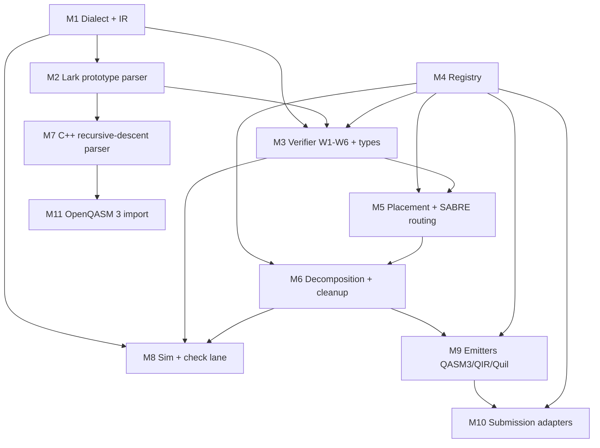

# M0 — Phase A Overview

This is the entry point for Phase A. Read this first; everything
else in this folder hangs off it.

## What Phase A delivers

A **command-line compiler called `spinorc`** that:

1. Parses a `.spn` source file (or imports an OpenQASM 3 subset).
2. Verifies it (six legality rules + quantum/classical type
   check).
3. Lowers it to one named chip's hardware contract via three
   passes: **placement**, **SABRE routing**, **gate
   decomposition**, plus a small post-decomposition cleanup.
4. Validates the result on a simulator (Stim for stabilizer
   circuits, an Eigen-based statevector engine for general
   small circuits) and reports resource estimates.
5. Emits to **OpenQASM 3** (with `#pragma braket verbatim
   box`), **QIR** (Base + Adaptive profiles), or **Quil**.
6. Submits to providers (IBM, AWS Braket, Azure Quantum) in
   **verbatim / pass-through** mode, so the vendor compiler
   cannot re-optimize our output.

By the end of Phase A, `spinorc` is a usable, testable,
sellable artifact on its own. Phonon (Phase B) lowers into
Spinor; Photon (Phase C) lowers into Phonon; the Platform
(Phase D) wraps the engine in a job service. None of those
exist yet.

## Three on-ramps (pick the one that fits you)

The Phase A user guide and this spec set are designed to be
readable by any of three backgrounds. Pick yours and read in
this order.

### A. "I know quantum, but not compilers / MLIR"

You're comfortable with qubits, gates, circuits, Qiskit /
Braket SDKs. Your gap is on the compiler side.

1. Read [glossary.md](glossary.md) §"Compiler concepts."
2. Read the introductory chapter of MLIR's "Toy" tutorial:
   <https://mlir.llvm.org/docs/Tutorials/Toy/>. You don't need
   to do it; just understand what a *dialect*, an *op*, and a
   *pass* are.
3. Read [M1_dialect.md](M1_dialect.md). The Spinor MLIR
   dialect is the spine of everything else.

### B. "I know compilers, but not quantum"

You've written passes in LLVM/MLIR. Your gap is on the physics
side.

1. Read [glossary.md](glossary.md) §"Quantum concepts."
2. Read Chapter 1 of the Vision doc
   ([quantum_stack_vision_and_technical_concept.docx][vision]):
   thirty pages, takes you from "what is a qubit" to reading
   the Bell program. Stop at the end of Chapter 1.
3. Read [M1_dialect.md](M1_dialect.md) for what we model in
   the IR; the gates and qubit type are the only quantum-side
   primitives that matter for Phase A.

### C. "I know neither"

Read the Vision doc cover to cover. It is written explicitly
for a developer with no compiler and no quantum background;
nothing important is shown before you have what you need to
read it. Then return here.

[vision]: ../../../docs/spinor_engineering_deep_dive.docx

## Dependency graph

Each milestone consumes the milestones above it. No milestone
may start before all its inputs are green in CI.

Reading order for someone resuming the build cold:
**M1 → M2 → M3 → M4 → M5 → M6 → M7 → M11 → M8 → M9 → M10.**

## The two contracts (one-paragraph reminder)

Every Spinor program's first line is `target generic` or
`target <device-id>`. Under **generic**, the gate vocabulary
is the standard set (`h x y z s sdg t tdg rx ry rz cx cz
swap`), connectivity is not checked, and qubit indices are
virtual — names. Under a **device**, the gate vocabulary is
that chip's native set (read from the registry), every
two-qubit gate must operate on a physically connected pair,
and qubit indices are physical. **Spinor's job is the one-way
compiler path between these two contracts.** That is the whole
point of Phase A.

## The five rules (master copy lives in
[handoff doc §5][handoff]; restated for visibility)

1. **Build bottom-up.** Spinor first. Don't open Phonon until
   M1–M10 are green and `phaseA_progress.md` says so.
2. **Optimization does not live in Spinor.** Specialize, don't
   shrink. The only optimization here is the local
   post-decomposition cleanup.
3. **One C++ engine.** Python only as a throwaway prototype
   (Lark parser, deleted at M7) and the future thin nanobind
   binding (Phase C).
4. **Re-verify and pin.** Versions are pinned in
   [`cmake/Versions.cmake`](../../../cmake/Versions.cmake);
   the human-readable companion is
   [`docs/build/versions.md`](../versions.md).
5. **Verbatim submission only.** Every emitter produces
   verbatim-ready output; every adapter submits with the
   provider's compiler disabled.

[handoff]: ../../../docs/specs/00_implementation_handoff_and_repo_strategy.docx

## What is *not* in Phase A

So new contributors don't waste time:

- No control flow (`if`, `for`, `while`). Lives in Phonon.
- No functions / subroutines beyond a flat statement list.
  Lives in Phonon.
- No big optimizer (cancellation, ZX, scheduling). Lives in
  Phonon.
- No high-level OO surface. Lives in Photon.
- No web playground / job service. Lives in the Platform.
- No automatic synthesis from classical code. That is the
  research summit (Phase E), explicitly out of scope.

If you find yourself adding any of these to Spinor, stop. It
is an architecture error.

## Where to put new code

| You're adding…              | Folder                                                                           |
| --------------------------- | -------------------------------------------------------------------------------- |
| A new MLIR op               | `spinor/dialect/`                                                                |
| A grammar rule              | `spinor/parser/lark/grammar.lark` (M2) → `spinor/parser/cpp/` (M7)               |
| A verifier rule             | `spinor/verify/`                                                                 |
| A chip                      | `spinor/registry/chips/<id>.yaml` (no code change!)                              |
| A coupling-map topology     | `spinor/registry/topologies/<name>.yaml`                                         |
| A pass                      | `spinor/passes/<placement\|routing\|decompose\|cleanup>/`                        |
| A simulator backend         | `spinor/sim/`                                                                    |
| An emitter                  | `spinor/emit/<qasm3\|qir\|quil>/`                                                |
| A provider adapter          | `spinor/submit/<ibm\|aws\|azure>/`                                               |
| A test                      | `spinor/tests/<unit\|integration\|regression>/Mxx_*` (mirror milestone)          |
| Anything in Phonon/Photon   | **Stop.** This is Phase A.                                                       |

## Spec status

| Milestone | Spec landed | Code landed | Tests green |
| --------- | ----------- | ----------- | ----------- |
| M0        | yes         | n/a         | n/a         |
| M1        | yes         | yes         | yes         |
| M2        | yes         | yes         | yes         |
| M3        | yes         | yes         | yes         |
| M4        | yes         | yes         | yes         |
| M5        | yes         | yes         | yes         |
| M6        | yes         | yes         | yes         |
| M7        | yes         | yes         | yes         |
| M11       | yes         | yes         | yes         |
| M8        | yes         | yes         | yes         |
| M9        | yes         | yes         | yes         |
| M10       | yes         | yes         | yes         |

This table is updated as milestones land.
