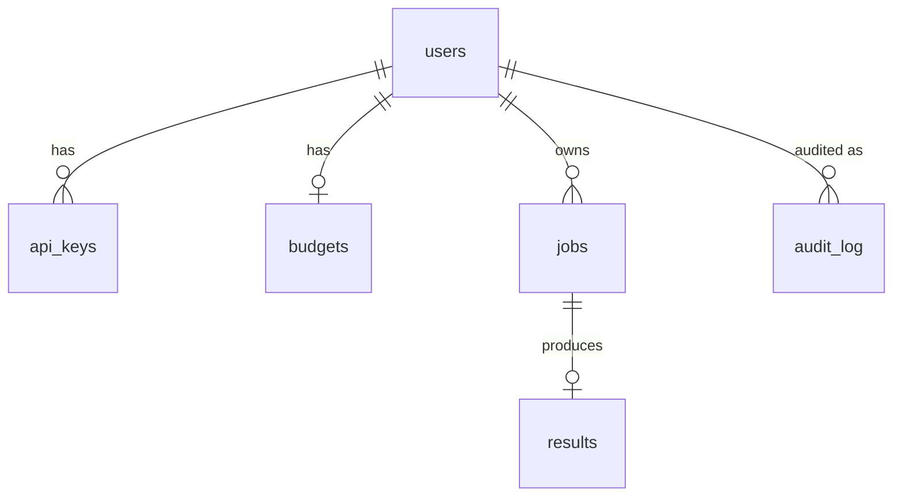
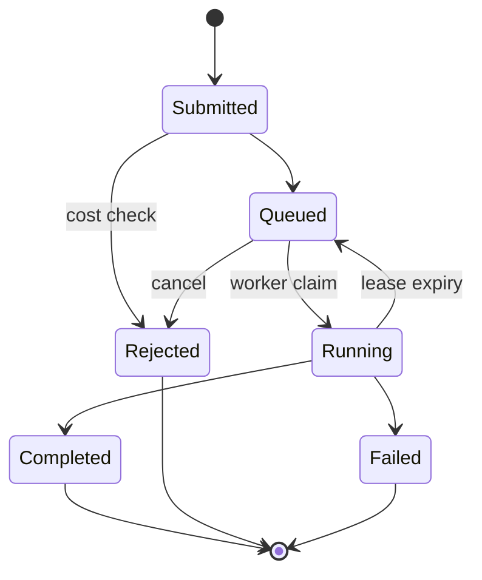

# M1 — Job model + storage

End: a SQLAlchemy 2.0 ORM that captures users, api_keys, budgets,
jobs, results, calibration_snapshots, and audit_log; a state machine
on `Job` that allows only the legal transitions; an Alembic 0001_init
migration that creates the same schema in Postgres 17.

## Schema

## State machine

Legal transitions live in `models.LEGAL_TRANSITIONS`; `Job.transition`
raises `IllegalTransitionError` for anything else.

## Tests landed

- `test_state_machine.py` — every legal path, every illegal pair.
- `test_models.py` — round-trip of User/Job/Result/Budget/AuditLog.
- `test_crash_resume.py` — Running with expired lease re-queued and
  the audit log preserves the journal of events.
- `test_alembic_roundtrip.py` — metadata mirrors the migration.

26 unit tests green (no Postgres needed; SQLite in-memory).
