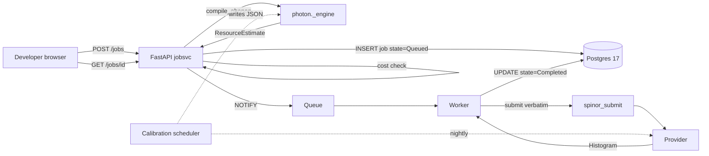

# Phase D — Platform User Guide

End-of-phase user-facing guide. The document a person new to the
project reads to understand and use the platform — the FastAPI job
service, the React + Monaco playground, and the operations around
them.

For per-milestone engineering specs see [`phaseD/`](phaseD/README.md).
For the build journal see [`phaseD_progress.md`](phaseD_progress.md).
For deviations from the Platform Services Deep-Dive see
[`phaseD_decisions.md`](phaseD_decisions.md).

---

## Three on-ramps

Pick yours:

- **From quantum.** Read §2 (write a Bell program, click Run) and §6
  (cost control + calibration — the two places quantum bites the
  platform).
- **From web.** Read §3 (FastAPI surface), §4 (deployment) and §5
  (operations). The job service is conventional — recognising the
  shape is most of the work.
- **From neither.** Read §1 → §2 → §3 → §4 → §5 → §6 in order.

The full glossary lives at [`phaseD/glossary.md`](phaseD/glossary.md).

---

## §1 — Where the platform sits

```
Photon         <- you write here (Phase C)
  v
Phonon         <- chip-independent IR + the optimizer (Phase B)
  v
Spinor         <- chip-specific portable assembly (Phase A)
  v
provider       <- IBM / AWS / Azure / direct vendor APIs

  ^------ Phase D wraps this whole stack ------^
       FastAPI  +  Worker  +  Calibration  +  Playground
```

Phase D is a wrapper, not a compiler. It calls the C++ engine through
the Phase C nanobind binding [`photon._engine`](../../photon/bindings/python/Module.cpp),
gets back a `CompiledProgram` plus a `ResourceEstimate`, runs a cost
check, queues the job in Postgres, and a worker submits it
**verbatim** through the Phase A
[`spinor_submit`](../../spinor/submit/python/spinor_submit/__init__.py)
adapter. Two seams are quantum-specific (cost control, nightly
calibration); everything else is conventional web infrastructure.

End-to-end:



---

## §2 — Quickstart in five minutes

Three steps, three terminals. Assumes Docker is installed.

```bash
git clone <repo>
cd quantum-stack/platform/deploy
cp .env.example .env

./run.sh up -d                          # builds and starts everything
```

When `./run.sh smoke` returns `OK`, open http://localhost:8080 in a
browser. You'll see the login page. Default credentials seeded by the
compose file:

| Email | Password | Role |
|-------|----------|------|
| `admin@local` | `admin-password` | admin |

(After login change the password and create a non-admin user via
`Settings` → admin endpoints, or via the seed CLI:
`docker compose exec jobsvc python -m jobsvc.seed me@x.com pwd`.)

In the playground:

1. Pick `generic` from the target dropdown.
2. Leave the Bell program in the editor (it's the default).
3. Click **Run**.

Within a second or two the right-hand pane shows a `00 / 11` histogram
— the worker compiled, submitted to the local simulator, and stored
the result. You've just walked through every layer of the stack.

---

## §3 — Job-service API reference

Versioned under `/api/v1`. OpenAPI lives at `/api/openapi.json` and is
browsable at `/api/docs`.

### Authentication

Two equivalent paths:

```bash
# JWT (used by the Playground)
curl -s -X POST http://localhost:8000/api/v1/login \
     -H 'Content-Type: application/json' \
     -d '{"email":"admin@local","password":"admin-password"}'
# {"access_token":"eyJ...","refresh_token":"eyJ...","token_type":"bearer","expires_in":3600}

# API key (programmatic)
curl -s -X POST http://localhost:8000/api/v1/me/api-keys \
     -H "Authorization: Bearer $TOKEN" \
     -d '{"label":"my-script"}'
# {"plaintext":"Q4r2p8aA.GvXc...","prefix":"Q4r2p8aA",...}
```

The API key plaintext is shown **once** at creation. Use it as
`X-API-Key: <plaintext>`.

### Submitting a job

```bash
curl -s -X POST http://localhost:8000/api/v1/jobs \
     -H "Authorization: Bearer $TOKEN" \
     -H 'Content-Type: application/json' \
     -d '{
           "source": "target generic\nqubit q[2]\nh q[0]\ncx q[0], q[1]\n",
           "source_kind": "spinor",
           "target": "generic",
           "shots": 1000
         }'
```

Response (201):

```json
{
  "id": "7f2a5b8c-...",
  "user_id": "...",
  "name": "",
  "target": "generic",
  "shots": 1000,
  "source_kind": "spinor",
  "state": "Queued",
  "estimate": { "num_qubits": 2, "depth": 4, "two_qubit_count": 1, "t_count": 0 },
  "dollar_cost": "0.000000",
  "provider": "local",
  "created_at": "2026-06-16T...",
  "queued_at": "2026-06-16T..."
}
```

### Polling for completion

```bash
curl -s -H "Authorization: Bearer $TOKEN" \
     http://localhost:8000/api/v1/jobs/$JOB_ID
```

Once `state` is `Completed` the response includes `result.counts`
(the histogram).

### Cancelling

```bash
curl -X DELETE -H "Authorization: Bearer $TOKEN" \
     http://localhost:8000/api/v1/jobs/$JOB_ID
```

Only `Submitted` and `Queued` jobs can be cancelled.

### Listing

```bash
# Paged; up to 100 per page; cursor for next.
curl -s -H "Authorization: Bearer $TOKEN" \
     'http://localhost:8000/api/v1/jobs?limit=20&state=Completed'
```

### Targets

```bash
curl -s http://localhost:8000/api/v1/targets
```

Returns every chip the compiler's registry knows about plus the
synthetic `generic` target, with pricing.

### Budgets

```bash
curl -s -H "Authorization: Bearer $TOKEN" \
     http://localhost:8000/api/v1/me/budget
# {"daily_usd":"1.0000","monthly_usd":"10.0000","max_shots_per_job":10000}

curl -X PATCH -H "Authorization: Bearer $TOKEN" \
     -H 'Content-Type: application/json' \
     -d '{"daily_usd":"5.00"}' \
     http://localhost:8000/api/v1/me/budget
```

### What 402 looks like (over-budget rejection)

```json
{
  "detail": {
    "reason": "exceeds_daily_budget",
    "dollar_cost": "0.330000",
    "daily_usd": "0.10",
    "recent_daily_spend": "0",
    "daily_remaining": "0.10",
    "suggestion": "reduce shots, pick a cheaper target, or raise the daily budget."
  }
}
```

The job persists as `state=Rejected` so it appears in the user's job
history.

---

## §4 — The Playground walkthrough

Four pages:

- **`/login`** — email + password.
- **`/`** — the Playground itself: Monaco editor on the left,
  estimate + histogram on the right.
- **`/jobs`** — paginated history of your jobs (auto-refresh).
- **`/settings`** — read and update your budget.

The Run button compiles, queues, and polls for completion. Errors
land as banners:

| Banner kind | Cause |
|---|---|
| Red, "Over budget" | 402 — your shot count × chip pricing exceeds the budget. |
| Red, "Compile failed" | 400 — the engine rejected the source; the diagnostic is included verbatim. |
| Red, "unauthorized" | 401 — your JWT expired; refresh the page to re-login. |

### Editor tips

- The language picker (top bar: `spinor / phonon / photon`) switches
  Monaco's syntax highlighting.
- Switching the target to a real chip (`ibm_heron_r2`) flips the
  pricing the cost-control seam compares against. Try over-budgeting
  by setting your daily to `0.05` and submitting `1000` shots on
  `ibm_heron_r2`.

---

## §5 — Operations

### Logging

Logs are JSON via structlog with `request_id`, `user_id`, `job_id`,
`provider`, `chip`, and `state`. Request-id middleware echoes
`x-request-id` from the caller; pass your own to correlate
client-side traces.

Example line:

```json
{"event":"request.end","method":"POST","path":"/api/v1/jobs",
 "status":201,"duration_ms":18,
 "request_id":"7c1a5...","level":"info","timestamp":"2026-06-16T..."}
```

### Metrics

`GET /metrics` returns Prometheus text format:

| Metric | Type | Labels |
|--------|------|--------|
| `jobs_total` | counter | `state` ∈ {Completed, Rejected, Failed} |
| `job_duration_seconds` | histogram | `state` |
| `queue_depth` | gauge | — |
| `worker_lease_expirations_total` | counter | — |
| `provider_latency_seconds` | histogram | `provider` |
| `errors_total` | counter | `kind` ∈ {our, provider} |
| `calibration_refresh_total` | counter | `chip`, `ok` |

The `errors_total{kind=…}` split is the workhorse: a provider outage
spikes `kind="provider"` while leaving `kind="our"` flat.

### Health

- `GET /healthz` — process up.
- `GET /readyz` — database reachable.

### Database migrations

Alembic on first start:

```bash
docker compose exec jobsvc alembic upgrade head
docker compose exec jobsvc alembic history
```

### Adding a user

```bash
docker compose exec jobsvc python -m jobsvc.seed me@x.com hunter2
# created: 4f1a... (me@x.com, user)
```

### Calibration

The scheduler runs nightly at 02:00 UTC. To force a refresh now:

```bash
docker compose exec scheduler calibration --once
```

Each chip's YAML (`spinor/registry/chips/<chip>.yaml`) declares
`calibration.source` (`fixture | ibm_runtime_api | aws | azure`) and
`calibration.refresh` (`nightly | never`). At v1 only `fixture` and
`ibm_runtime_api` are wired; AWS and Azure are stubs (D5).

---

## §6 — The two quantum-specific seams

Most of Phase D is conventional web. The two places where quantum
bites the platform:

### 6.1 Cost control

The compiler's check lane already produces a `ResourceEstimate`. The
service multiplies `shots × chip.pricing.per_shot_usd`, compares to
`Budget.daily_usd - recent_daily_spend` (and the monthly window), and
either queues the job or rejects it with a 402 — **before** spending
anything. Every chip YAML carries pricing already; adding a chip
means a YAML, not code.

### 6.2 Nightly calibration refresh

Each chip YAML names `calibration.store: ~/.cache/spinor/calibration/<chip>.json`.
APScheduler runs nightly, calls each provider, atomically replaces
that file. The compiler reads the file at compile time. No code in
the compiler changes when calibration drifts.

---

## §7 — Pinned versions

Re-verified upstream **2026-06-16**.

| Component | Pin | Source |
|---|---|---|
| FastAPI | **0.137.1** | fastapi.tiangolo.com |
| PostgreSQL | **17.10** | postgresql.org (latest 17.x) |
| React | **19.2.7** | react.dev (avoids 19.2.0–19.2.6 CVEs) |
| @monaco-editor/react | **^4.7.0** | suren-atoyan/monaco-react |
| monaco-editor | ^0.52.2 | microsoft.github.io/monaco-editor |
| Vite | ^6 | vitejs.dev |
| TypeScript | ^5.6 | typescriptlang.org |
| TanStack Query | ^5 | tanstack.com/query |
| Zustand | ^5 | zustand-demo.pmnd.rs |
| Recharts | ^2 | recharts.org |
| Playwright | ^1.48 | playwright.dev |
| Vitest | ^2 | vitest.dev |
| SQLAlchemy | ^2.0 | sqlalchemy.org |
| asyncpg | ≥0.29 | github.com/MagicStack/asyncpg |
| Alembic | ^1.13 | alembic.sqlalchemy.org |
| Pydantic | ^2.7 | docs.pydantic.dev |
| APScheduler | ^3.10 | apscheduler.readthedocs.io |
| python-jose[cryptography] | ^3.3 | github.com/mpdavis/python-jose |
| passlib[bcrypt] | ^1.7.4 (with bcrypt <4.1) | passlib.readthedocs.io |
| structlog | ^24 | structlog.org |
| prometheus-client | ^0.20 | github.com/prometheus/client_python |
| nanobind | **2.12.0** | github.com/wjakob/nanobind (from Phase C) |

Authoritative pins live in:

- `platform/jobsvc/pyproject.toml`
- `platform/calibration/pyproject.toml`
- `platform/playground/package.json`

---

## §8 — Where to put new code

| You're adding… | Folder |
|---|---|
| A new endpoint | `platform/jobsvc/src/jobsvc/routers/` |
| A field on a model | `models.py` + an Alembic migration in `alembic/versions/` |
| A new provider | `platform/calibration/src/calibration/providers/` and add to `_REGISTRY` |
| A Monaco language tweak | `platform/playground/src/languages/` |
| A new SPA page | `platform/playground/src/pages/` |
| A new chip | `spinor/registry/chips/<id>.yaml` (no code change!) |
| Anything in Spinor / Phonon / Photon | **Stop.** Wrong phase. |

---

## §9 — Troubleshooting

| Symptom | Cause / fix |
|---|---|
| `502 Bad Gateway` from the playground | jobsvc isn't ready yet; `docker compose logs jobsvc`. The compose file runs `alembic upgrade head` on first start. |
| `401 unauthorized` immediately on Run | JWT expired; refresh the page. |
| `402 over budget` for a job you expect to fit | Your daily window has accumulated spend from earlier jobs in non-Rejected states. `GET /me/budget` and `GET /jobs?state=Queued|Running|Completed|Failed` to see what's counted. |
| `400 compile_failed` | The engine returned a parse/typecheck diagnostic. Inspect `detail.error` for the file/line. |
| `provider error` in the metrics | The provider adapter raised. `cassette` mode skips network entirely; switch to `cassette` to confirm the issue is upstream. |
| Calibration JSON not updating | `calibration.refresh: nightly` not set in chip YAML, or the scheduler hasn't fired yet. `docker compose exec scheduler calibration --once`. |
| Histogram never appears | Worker isn't running; `docker compose logs worker`. |

---

## §10 — Definition of Done (Phase D)

All boxes ticked at end-of-phase:

- [x] A developer writes a program in the browser, clicks Run, and
      sees a histogram — compiled through all four layers, cost-checked,
      submitted verbatim, tracked as a durable job.
- [x] Over-budget jobs are rejected before spending; calibration
      refreshes nightly and feeds compilation.
- [x] The service calls the C++ engine via the binding and never
      reimplements compilation.
- [x] Users are isolated; the stack deploys from containers;
      observability distinguishes our failures from providers'.
- [x] All milestone tests pass: 80 jobsvc + 19 calibration + 8
      playground = **107/107** at end of phase.
- [x] `phaseD_progress.md`, `phaseD_decisions.md`,
      `phaseD_platform_guide.md` (this file) written.
- [x] Phases A–D together are a complete, usable product. Phase E
      stays out of scope.

---

## §11 — Glossary

See [`phaseD/glossary.md`](phaseD/glossary.md). If you find a term
not listed there, it is a documentation bug — please file or fix.
