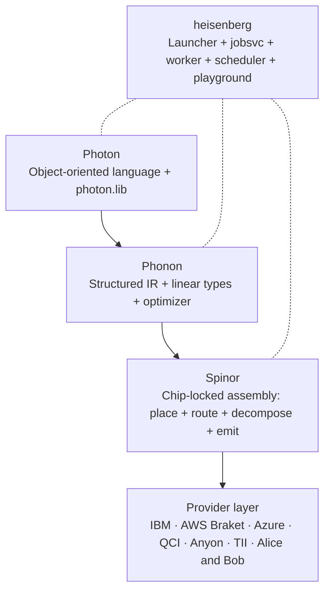

<div class="hero" markdown>

# Heisenberg Quantum Stack

<p class="lead">
A four-layer quantum compiler — <strong>Photon · Phonon · Spinor</strong> —
plus a single-command launcher and a browser playground. Write a quantum
program once; run it on any of <strong>27 chips</strong>.
</p>

[Quickstart :material-arrow-right:](quickstart.md){ .md-button .md-button--primary }
[Languages :material-arrow-right:](languages/index.md){ .md-button }
[SDKs :material-arrow-right:](sdks/index.md){ .md-button }

</div>

---

## What Heisenberg gives you



Three things that nobody else does:

- **Verbatim submission only.** The compiler produces a chip-locked
  artefact; the provider sends it as-is. No silent re-transpilation.
- **Cost control before the cloud bill.** Every job is priced from a
  real `ResourceEstimate` (gates × calibration × `per_shot_usd`) and
  rejected client-side if it would blow the user's budget.
- **One language per layer, three SDKs.** Write a circuit in
  Spinor / Phonon / Photon; integrate from Python, C++, or
  TypeScript / REST. Same backend, three doors.

## Try it in 30 seconds

```bash
pip install heisenberg
heisenberg init      # creates ~/.local/share/heisenberg/, runs migrations
heisenberg seed      # creates admin@local + an API key (printed once)
heisenberg run       # starts everything; opens http://127.0.0.1:8080/
```

Click **Run** in the playground. Within a second you see a
`00 / 11` histogram — the Bell pair, compiled through every layer,
submitted in cassette mode, returned to the editor.

The full quickstart is on the next page.

## Pick a path

<div class="grid cards" markdown>

-   :material-pencil:{ .lg .middle } **I write quantum programs**

    ---

    Read [Languages](languages/index.md). Three siblings:
    [Spinor](languages/spinor/index.md) is the chip-locked assembly,
    [Phonon](languages/phonon/index.md) is the structured IR with
    linear types, [Photon](languages/photon/index.md) is the OO
    user-facing language with three frontends.

-   :material-code-tags:{ .lg .middle } **I integrate from my code**

    ---

    Read [SDKs](sdks/index.md). The same task — submit a Bell job —
    written three ways: in Python, in C++, and in TypeScript on top
    of the typed `@heisenberg/sdk` REST client.

-   :material-server:{ .lg .middle } **I deploy the platform**

    ---

    Read [Operations](operations/index.md). Single-command laptop
    install, native systemd services for production, optional
    Postgres, calibration scheduling, observability.

-   :material-book-open-variant:{ .lg .middle } **I want the design**

    ---

    Read [Internals](internals/index.md). The
    [architecture](internals/architecture.md), the
    [seven critical rules](internals/seven_rules.md), the
    [decisions log](internals/decisions.md), and the public
    [future plan](internals/futureplan.md).

</div>

## Pinned versions

| Component | Pin | Verified |
|---|---|---|
| FastAPI | 0.137.1 | 2026-06-16 |
| PostgreSQL (optional) | 17.10 | 2026-06-16 |
| React | 19.2.7 | 2026-06-16 |
| `@monaco-editor/react` | ^4.7.0 | 2026-06-16 |
| LLVM / MLIR | 22.1.8 | 2026-06-16 |
| nanobind | 2.12.0 | 2026-06-16 |
| Python | 3.13 (3.12 floor) | 2026-06-16 |

Authoritative pins live in
[`platform/jobsvc/pyproject.toml`](https://github.com/nimesh08/quantum-stack/blob/main/platform/jobsvc/pyproject.toml),
[`platform/playground/package.json`](https://github.com/nimesh08/quantum-stack/blob/main/platform/playground/package.json),
and
[`cmake/Versions.cmake`](https://github.com/nimesh08/quantum-stack/blob/main/cmake/Versions.cmake).

---

Heisenberg, Spinor, Phonon and Photon were designed and implemented
by **Nimesh Cheedella**. The project is licensed under
[Apache-2.0](https://github.com/nimesh08/quantum-stack/blob/main/LICENSE).
