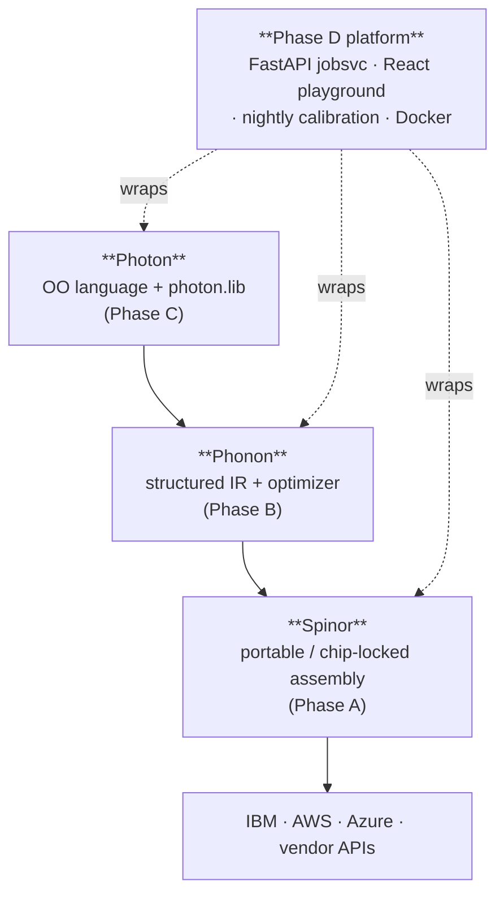

<div class="hero" markdown>

# Heisenberg Quantum Stack

<p class="lead">
A four-layer quantum compiler — Photon · Phonon · Spinor — wrapped in a
FastAPI job service, a React + Monaco playground, and a Docker
deployment. <strong>Write a program once, run it on any chip.</strong>
</p>

[Quickstart :material-arrow-right:](quickstart.md){ .md-button .md-button--primary }
[API reference :material-arrow-right:](api/index.md){ .md-button }

</div>

---

## The four layers



Each layer has its own deep-dive:

- [Phase A — Spinor](https://github.com/nimesh08/quantum-stack/blob/main/docs/build/phaseA_spinor_guide.md)
- [Phase B — Phonon](https://github.com/nimesh08/quantum-stack/blob/main/docs/build/phaseB_phonon_guide.md)
- [Phase C — Photon and the frontends](https://github.com/nimesh08/quantum-stack/blob/main/docs/build/phaseC_photon_guide.md)
- **Phase D — Platform** (this site)

## Try it in 30 seconds

```bash
git clone https://github.com/nimesh08/quantum-stack.git
cd quantum-stack/platform/deploy
cp .env.example .env
./run.sh up -d                           # builds db + jobsvc + worker + scheduler + playground
open http://localhost:8080               # log in: admin@local / admin-password
```

Click **Run** in the playground. Within a second you'll see a
`00 / 11` histogram — the Bell program, compiled through every
layer, submitted verbatim, returned to the editor. That single
click drives the entire stack.

## What you can build

- **Submit jobs from your terminal**:
  ```python
  import httpx
  r = httpx.post("http://localhost:8000/api/v1/jobs",
      headers={"X-API-Key": "Q4r2p8aA....."},
      json={
          "source": "target generic\nqubit q[2]\nh q[0]\ncx q[0], q[1]\n",
          "source_kind": "spinor",
          "target": "ibm_heron_r2",
          "shots": 1000,
      })
  print(r.json()["estimate"])
  ```
- **Browse the API**: see [API reference](api/index.md) — every endpoint,
  every Python symbol, every TypeScript export, with request/response
  shapes and copy-pasteable examples.
- **Add a new chip** without writing compiler code:
  see [Add a chip in 30 minutes](tutorial/add_a_chip.md).

## Two quantum-specific seams

Most of the platform is conventional web infrastructure assembled, not
invented. Two pieces are quantum-specific:

1. **Cost control** — every submission consults the compiler's
   `ResourceEstimate`, multiplies `shots × chip.pricing.per_shot_usd`,
   and rejects over-budget jobs **before** spending.
   See [`jobsvc.cost`](api/python/jobsvc/cost.md).
2. **Nightly calibration refresh** — APScheduler hits each provider,
   atomically replaces the per-chip JSON the compiler reads.
   See [`calibration.main`](api/python/calibration/main.md).

## Pinned versions

| Component | Pin | Verified |
|---|---|---|
| FastAPI | 0.137.1 | 2026-06-16 |
| PostgreSQL | 17.10 | 2026-06-16 |
| React | 19.2.7 | 2026-06-16 |
| @monaco-editor/react | ^4.7.0 | 2026-06-16 |
| LLVM / MLIR | 22.1.8 | 2026-06-16 |
| nanobind | 2.12.0 | 2026-06-16 |

Authoritative pins: [`platform/jobsvc/pyproject.toml`](https://github.com/nimesh08/quantum-stack/blob/main/platform/jobsvc/pyproject.toml),
[`platform/playground/package.json`](https://github.com/nimesh08/quantum-stack/blob/main/platform/playground/package.json),
[`cmake/Versions.cmake`](https://github.com/nimesh08/quantum-stack/blob/main/cmake/Versions.cmake).

## Where to next

<div class="grid cards" markdown>

-   :material-rocket-launch:{ .lg .middle } **New here?**

    ---

    Read the [Quickstart](quickstart.md) and the
    [Bell tutorial](tutorial/bell.md). Five minutes start to histogram.

-   :material-api:{ .lg .middle } **Building against the API?**

    ---

    Browse the full [REST reference](api/rest/index.md), the
    [Python jobsvc reference](api/python/jobsvc/index.md), or the
    [TypeScript reference](api/typescript/index.md).

-   :material-server:{ .lg .middle } **Deploying?**

    ---

    [Operations guide](guide/operations.md) covers Docker compose,
    observability, calibration, and provider credentials.

-   :material-book-open-variant:{ .lg .middle } **Want the design?**

    ---

    [Decisions](guide/decisions.md) explains every deviation from the
    deep-dive specs. The [Build journal](guide/progress.md) is the
    append-only log of how it was built, milestone by milestone.

</div>
