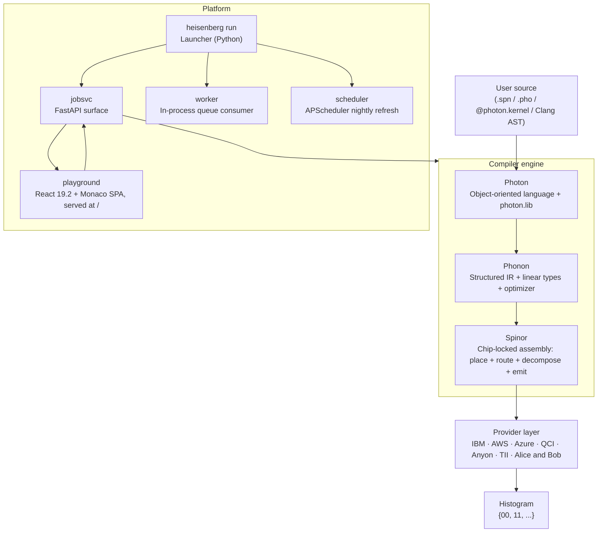

# Architecture

Heisenberg is one C++ compiler engine wrapped in three things: an
HTTP service, a CLI launcher, and a browser playground. This page
walks the data flow end to end and points at the file in the
repository where each step lives.

## The four layers

The compiler is one C++ engine (RULE 3). The Python and TypeScript
layers do **not** reimplement compilation — they call into the
engine through a `nanobind` binding (`photon._engine`) and shell out
to the `spinorc` binary for things the binding does not yet expose.

## File-by-file flow of a single Bell job

| Step | Where it lives | What it does |
|------|----------------|--------------|
| 1. Editor sends source | [`platform/playground/src/api/jobs.ts`](https://github.com/nimesh08/quantum-stack/blob/main/platform/playground/src/api/jobs.ts) | `POST /api/v1/jobs` with `source`, `target`, `shots`. |
| 2. FastAPI accepts | [`platform/jobsvc/src/jobsvc/routers/jobs.py`](https://github.com/nimesh08/quantum-stack/blob/main/platform/jobsvc/src/jobsvc/routers/jobs.py) | Authenticates the API key, validates the body, classifies the source kind. |
| 3. Compile preview | [`platform/jobsvc/src/jobsvc/engine.py`](https://github.com/nimesh08/quantum-stack/blob/main/platform/jobsvc/src/jobsvc/engine.py) | Runs the C++ engine to produce a `ResourceEstimate` (gate count, depth, dollar cost). |
| 4. Cost gate | [`platform/jobsvc/src/jobsvc/cost.py`](https://github.com/nimesh08/quantum-stack/blob/main/platform/jobsvc/src/jobsvc/cost.py) | Multiplies `shots × chip.pricing.per_shot_usd`; rejects with 402 if it would blow the user's `Budget`. |
| 5. Enqueue | [`platform/jobsvc/src/jobsvc/queue.py`](https://github.com/nimesh08/quantum-stack/blob/main/platform/jobsvc/src/jobsvc/queue.py) | Inserts a `Job` row in `Queued` state with a lease policy. |
| 6. Worker claims | [`platform/jobsvc/src/jobsvc/worker.py`](https://github.com/nimesh08/quantum-stack/blob/main/platform/jobsvc/src/jobsvc/worker.py) | `claim()` atomically picks one `Queued` job onto this worker; recompiles the source. |
| 7. Submit verbatim | [`spinor/submit/python/spinor_submit/__init__.py`](https://github.com/nimesh08/quantum-stack/blob/main/spinor/submit/python/spinor_submit/__init__.py) | Hands the chip-locked artefact to the right vendor SDK in pass-through mode (RULE 5). |
| 8. Persist results | `worker.py` (same) + [`models.py`](https://github.com/nimesh08/quantum-stack/blob/main/platform/jobsvc/src/jobsvc/models.py) | Stores the histogram on a `Result` row, transitions the job to `Completed`. |
| 9. Browser polls | `playground` | `GET /api/v1/jobs/{id}` until `state == Completed`, then renders the histogram. |

In `heisenberg run` (the default `--dev` mode), steps 5-8 happen on
asyncio tasks **inside the FastAPI process**. In `--production`, the
worker and the calibration scheduler are separate child processes
(see [Operations / Native systemd](https://nimesh08.github.io/heisenberg-platform/operations/native_systemd/)).

## The compiler engine in detail

### Spinor (chip-locking)

[`spinorc compile -t <chip-id>`](../languages/spinor/install.md)
runs this pipeline on the parsed module:

1. **Placement** — assign logical to physical qubit indices.
2. **Routing (SABRE)** — insert SWAPs to honour the chip's coupling
   map.
3. **Decomposition** — KAK + Euler-ZYZ rewrites into the chip's
   native gate set.
4. **Cleanup** — drop trivial identities, fuse adjacent rotations.
5. **Emit** — OpenQASM 3.1, QIR, or Quil text.

The emitter chosen depends on the provider declared in the chip
YAML; see [`spinor/registry/chips/`](https://github.com/nimesh08/quantum-stack/tree/main/spinor/registry/chips).

### Phonon (structured IR)

Phonon's job is to reduce gate count and depth before Spinor sees
the program. It owns the optimizer (RULE 2 — Spinor never optimises).
Passes include cancellation, rotation merging, ZX simplification, and
scheduling. The linear type system enforces no-cloning at the type
level; see [Linear types](../languages/phonon/linear_types.md).

### Photon (front-end language)

Photon is what humans write. It is object-oriented, has loops and
conditionals, and supports three frontends — `.pho` source, the
`@photon.kernel` Python decorator, and a Clang LibTooling C++
ingester — that all converge on the same C++ engine via a `nanobind`
binding (RULE 3).

## The platform layer

The platform is conventional web infrastructure assembled around two
quantum-specific seams:

1. **Cost control** — `cost.check_budget()` runs before the job
   touches the queue. The compiler's `ResourceEstimate` makes this
   possible without a round-trip to the provider.
2. **Nightly calibration refresh** — APScheduler hits each provider,
   atomically replaces the per-chip JSON the compiler reads. See
   [Operations / Calibration refresh](https://nimesh08.github.io/heisenberg-platform/operations/calibration/).

Everything else (auth, audit log, rate limits, queue, observability)
is conventional FastAPI + SQLAlchemy + Prometheus.

## What is in this directory

The [archive](https://github.com/nimesh08/quantum-stack/tree/main/docs/archive)
holds the per-phase progress journals (`phaseA_progress.md` through
`phaseD_progress.md`) and the original engineering deep-dive
specs. Those are kept verbatim because they capture decisions and
rationale, but they speak in milestone language and are not the
user-facing documentation. Start here, dive there if you need it.

Heisenberg, Spinor, Phonon and Photon were designed and implemented
by **Nimesh Cheedella**.
