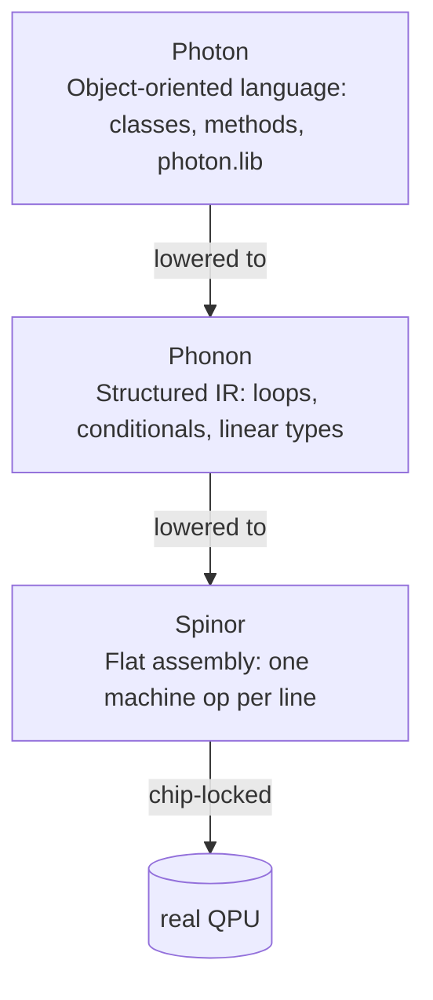

# Languages

Heisenberg ships **three** quantum programming languages, layered on
top of each other. You almost always write one and never see the
others — but knowing what each one is for helps you pick the right
abstraction.

## Pick a language

| You want to ... | Use | Why |
|-----------------|-----|-----|
| Express a circuit at the shortest possible level — one gate per line. | [Spinor](spinor/index.md) | The chip-locked, deterministic assembly. Twenty-two grammar rules. No loops, no functions. |
| Write a circuit *with structure* — `for`, `if`, parameterised sub-routines, but still in a quantum-native syntax. | [Phonon](phonon/index.md) | The structured IR. Linear types stop you from cloning a qubit by accident. Where the optimizer lives. |
| Write quantum kernels inside an OO program in your normal language. | [Photon](photon/index.md) | The user-facing language. Three frontends — `.pho` source, `@photon.kernel` Python decorator, Clang LibTooling C++ ingester — all converging on the same engine. |

When in doubt: **start in Photon**. It is what the playground gives
you by default and what every cookbook recipe uses. Drop down to
Phonon if you need explicit control over scheduling or the linear
type system. Drop all the way to Spinor only when you want to see or
hand-edit the chip-locked assembly that goes to the cloud.

## What every language has

Every language in this section ships with the same shape of
documentation. If you know one, you know where to look in the others:

- **Index** — what the language is for and a one-screen example.
- **Install** — how to get the toolchain on your machine.
- **Tutorial** — one runnable program, walked through line by line.
- **Lexical / Grammar / Types** — the formal reference.
- **Cookbook** — bite-sized recipes for real tasks.

## What every language is **not**

- Not a substitute for the others. Photon is not a "syntax wrapper"
  on Spinor; it adds OO structure and a different type discipline.
  Phonon is not just an optimisation pass; it has its own grammar
  and IR.
- Not a substitute for a vendor SDK. We do not reimplement Qiskit.
  Heisenberg compiles to whatever the vendor SDK accepts (OpenQASM
  3, QIR, Quil) and submits in pass-through mode.

---

Heisenberg, Spinor, Phonon and Photon were designed and implemented
by **Nimesh Cheedella**.
