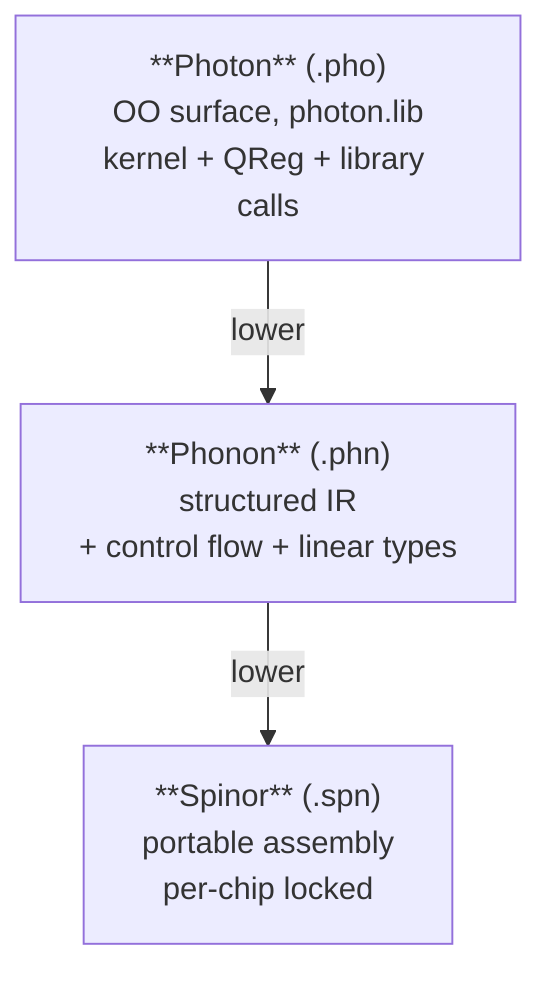
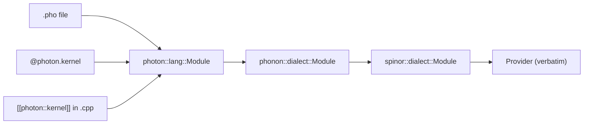

# Languages

The stack ships **three** quantum languages, each at a different level
of abstraction:



| Language | What it is | When to write it |
|---|---|---|
| [**Spinor**](spinor/index.md) | quantum assembly — one line per gate, no loops, no functions | when you want exact gate placement; the lowest layer a human writes |
| [**Phonon**](phonon/index.md) | Spinor + control flow + linear types (no-cloning enforced as a compile error) | when you need `if`, `for`, `def`, or feedforward |
| [**Photon**](photon/index.md) | object-oriented language: `QReg q(N); q.h(0); q.cx(0,1); q.bell_pair(0,1)` | when you want algorithms (Grover, QFT, teleport) as one-liners |

## Three on-ramps

- **From quantum** (you've used Qiskit / Braket / Cirq):
  start with [Spinor](spinor/index.md). The gate set will look familiar; the
  two-contracts model (`target generic` vs `target <chip>`) is the only
  genuinely new idea.
- **From compilers** (you've written a parser / used LLVM):
  start with [Phonon](phonon/index.md). The grammar is a small delta over
  Spinor; the linear type checker is what's interesting.
- **From application development**:
  start with [Photon](photon/index.md). Write Bell in eight lines of plain Python:

  ```python
  import photon

  @photon.kernel
  def bell():
      q = photon.QReg(2)
      q.h(0)
      q.cx(0, 1)
      return q.measure_int()
  ```

## The same program in all three

```spinor
target generic
qubit q[2]
bit c[2]
h q[0]
cx q[0], q[1]
c = measure q
```

```phonon
target generic
qubit q[2]
bit c[2]
h q[0]
cx q[0], q[1]
c = measure q
```

```photon
target generic
kernel bell() -> int {
    QReg q(2)
    q.h(0)
    q.cx(0, 1)
    return q.measure_int()
}
```

Same program, three levels. The compiler proves they produce identical
Spinor (the [convergence test](photon/rules/three_door_convergence.md)).

## Three doors, one engine



Whichever door you walk through, the engine compiles to the same
Spinor IR and submits the same QASM3 verbatim. The tutorials at
[Photon cookbook → bell_three_doors](photon/cookbook/bell_three_doors.md)
walks you through writing Bell in all three forms.
