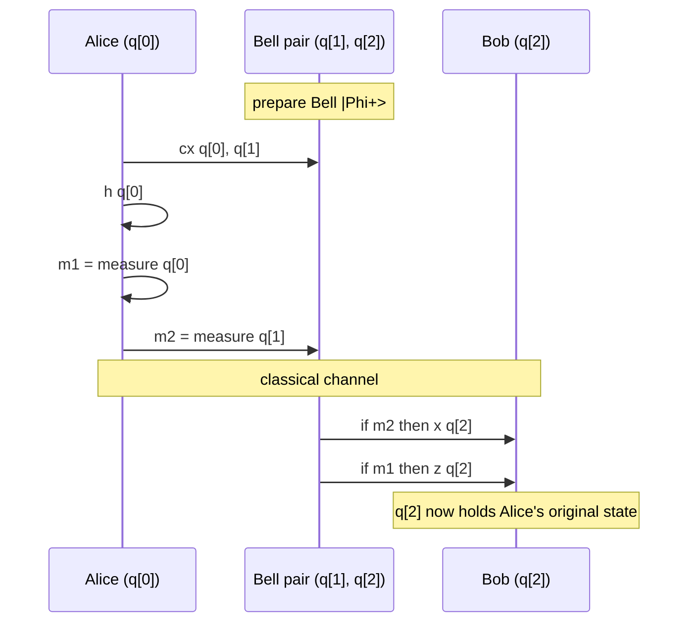

# Phonon — tutorial

We will write quantum **teleportation**: a routine that moves the
state of one qubit onto another using one Bell pair, two
measurements, and two classical-controlled Pauli gates. Teleport is
the canonical example of a Phonon program — it needs `if`, `def`,
and the linear type checker, all of which live above Spinor.

## What we are building



## Step 1 — write the source

Save as `teleport.pho`:

```phonon
target generic

def prepare_bell(qubit a, qubit b) {
  h a
  cx a, b
}

def correct(int m1, int m2, qubit target) {
  if m2 == 1 { x target }
  if m1 == 1 { z target }
}

qubit q[3]
bit  m[2]

; q[0] is Alice's payload; q[1], q[2] are the Bell pair.
prepare_bell(q[1], q[2])

; Bell measurement on Alice side.
cx q[0], q[1]
h  q[0]
m[0] = measure q[0]
m[1] = measure q[1]

; Classical-controlled correction on Bob side.
correct(m[0], m[1], q[2])
```

Two Phonon-specific features: `def` (the two helpers) and `if`
(classical-controlled corrections).

## Step 2 — verify it

```bash
spinorc verify -t generic teleport.pho
```

The Phonon verifier runs the **linear type checker** in addition to
the W1-W7 Spinor rules. If you tried to write `qubit b = q[1]`
(aliasing two names to the same qubit), the linear type checker
would reject it — the no-cloning theorem becomes a compile error.

## Step 3 — compile to a chip with feedforward

Not every chip supports mid-circuit measurement plus classical
control. The Phonon compiler legalises the program differently
depending on the chip's `supports.feedforward` field:

| Chip's feedforward | Strategy |
|--------------------|----------|
| `Full` | Conditional gates emit native QIR-Adaptive `branch` ops. |
| `Limited` | Conditional gates lower to a fixed pattern the hardware accepts. |
| `None` | The compiler refuses to compile feedforward; you can opt into [post-selection](rules/post_selection.md) instead. |

Try a chip with feedforward:

```bash
spinorc compile -t ibm_heron_r2 teleport.pho
```

And one without:

```bash
spinorc compile -t ionq_harmony teleport.pho
```

The IonQ Harmony compile fails with a precise diagnostic pointing at
the `if` statements and a link to the post-selection cookbook.

## Step 4 — see the optimizer at work

```bash
spinorc compile -t generic teleport.pho --dump phonon-after-opt
```

The optimizer cancels the `H q; H q` pair that the lowering
introduces if you did the obvious thing in `prepare_bell`. (Spoiler:
we wrote it efficiently above, so there is nothing to cancel — try
adding `h q[1]; h q[1]` between `prepare_bell` and `cx q[0], q[1]`
and re-run with `--dump`.)

## What you have learned

- Phonon is a strict superset of Spinor — every Spinor program is a
  legal Phonon program.
- `def`, `for`, `while`, `if` are the new vocabulary.
- The **linear type checker** turns no-cloning into a compile-time
  error.
- Feedforward (post-measurement classical control) is a property of
  the chip; the compiler legalises or rejects accordingly.
- The **optimizer** lives here, not in Spinor.

## Where to next

- [Linear types](linear_types.md) — the type system in depth.
- [Cookbook](cookbook/index.md) — Deutsch-Jozsa, parameterised
  circuits, classical branching.
- Move up: [Photon](../photon/index.md) gives you classes and
  methods on top of Phonon.

---

!!! quote "Credits"
    **Phonon** was designed and implemented by **Nimesh Cheedella**.
