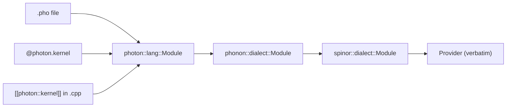

# Photon — overview

A `.pho` file declares one or more functions, at least one marked
`kernel`. Kernels are the entry points the runtime can execute.
Quantum registers are objects; gates are methods on them; algorithms
come from `photon.lib`.

```photon
target generic

kernel bell() -> int {
    QReg q(2)
    q.h(0)
    q.cx(0, 1)
    return q.measure_int()
}
```

Eight lines, fully runnable.

## Three doors, one engine

You can write the same program in three places, and the compiler
**proves they produce identical Spinor**:



The convergence test
[`photon/tests/m6/convergence_test.cpp`](https://github.com/nimesh08/quantum-stack/blob/main/photon/tests/m6/convergence_test.cpp)
compiles Bell + GHZ in all three forms and asserts identical Spinor
profiles + ResourceEstimates.

## What's available

- **Types**: `int`, `angle`, `bit`, `QReg(N)`, plus user-defined
  `Oracle` callbacks for `lib.grover`.
- **Gate methods on `QReg`** — every Spinor gate the engine
  supports: `h`, `x`, `y`, `z`, `s/sdg`, `t/tdg`, `rx/ry/rz`, `cx`,
  `cz`, `swap`, `sx/sxdg`, `ecr`, `ms`, `rzz`, `gpi`, `gpi2`,
  `u1q`, plus aliases `cnot` / `hadamard` / `phase`.
- **Control flow**: `for i in lo..hi { ... }` (compile-time bounds),
  `if (cond) { ... } else { ... }`.
- **Measurement**: `q.measure()` returns a bit register;
  `q.measure_int()` returns the joint outcome as an unsigned int.
- **Library**: `q.bell_pair(a, b)`, `q.ghz()`, `q.qft()`, `q.iqft()`,
  `q.grover(oracle, rounds)`, `q.teleport(s, a, d)`,
  `q.vqe_ansatz(depth)`. All seven implemented in
  [`photon/lang/cpp/lib/Library.cpp`](https://github.com/nimesh08/quantum-stack/blob/main/photon/lang/cpp/lib/Library.cpp).

## What is **not** available (deliberately)

- Free-function calls outside `photon.lib`. Add new library routines
  in `Library.cpp` instead.
- `while` loops without a compile-time bound (use `for`).
- Recursion. Inline the body or split into a `for` loop.
- Anything dynamic (file I/O, network, allocation in a kernel).

The full list of unsupported Python constructs is at
[unsupported_constructs](rules/unsupported_constructs.md).

## See also

- [Lexical structure](lexical.md)
- [Grammar](grammar.md)
- [Types](types.md)
- [`@photon.kernel`](reference/frontends/photon_kernel.md)
- [Cookbook: Bell, three doors](cookbook/bell_three_doors.md)
