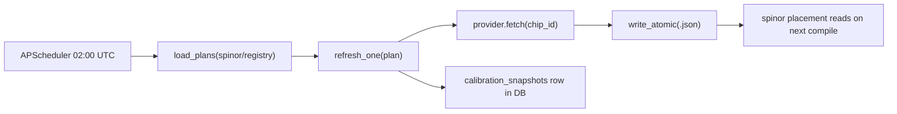

# Operations — Calibration refresh

The calibration scheduler runs nightly. Per chip, it fetches fresh
calibration data from the chip's provider and atomically writes a
JSON file the compiler reads on every placement decision.

## What it does



- Reads each YAML in `spinor/registry/chips/`.
- For chips with `calibration.refresh: nightly`, calls the right
  provider plugin.
- Writes the atomic JSON to the path the YAML declares.
- Records a `calibration_snapshots` row with the SHA-256 hash, the
  drift summary, and ok/error.

## Per-chip configuration (in the chip YAML)

```yaml
calibration:
  source:  ibm_runtime_api      # provider plugin name
  refresh: nightly              # nightly | never
  store:   ~/.local/share/heisenberg/calibration/ibm_heron_r2.json
```

Source plugins live in
[`platform/calibration/src/calibration/providers/`](https://github.com/nimesh08/quantum-stack/tree/main/platform/calibration/src/calibration/providers).
The shipped ones are `ibm`, `aws`, `azure`, `fixture`. New
providers are one Python file each.

## One-shot refresh (cron-like)

```bash
calibration --once --registry /usr/share/heisenberg/registry
```

Runs every chip once and exits. Useful for cron jobs or for hot
reloading after a chip YAML change.

## Drift detection

`diff()` computes the per-qubit and per-edge drift between the
previous file and the new fetch. Any drift over the chip's
`calibration.drift_threshold` is logged as
`calibration.refresh.drifted` with the qubit/edge IDs that moved.

This is the place to wire alerting if calibration data drifts more
than expected; tail the structured log for
`event=calibration.refresh.drifted`.

## Writing a new provider plugin

Two functions, one file:

```python
# platform/calibration/src/calibration/providers/myvendor.py
def fetch(chip_id: str) -> dict:
    """Return the chip's calibration JSON.

    Raise on failure; the scheduler records the error and leaves the
    previous file untouched.
    """
    ...

def name() -> str:
    return "myvendor"
```

Register it in `providers/__init__.py`:

```python
from . import myvendor
PROVIDERS["myvendor"] = myvendor
```

Set `calibration.source: myvendor` in your chip YAML and the
scheduler picks it up next run.

## Where the JSON files live

| Install shape | Path |
|---------------|------|
| `heisenberg run` (default) | `~/.local/share/heisenberg/calibration/<chip>.json` |
| systemd | `/var/lib/heisenberg/calibration/<chip>.json` |

The compiler's placement pass watches these paths. A file written
atomically (rename-after-write) is picked up on the next compile;
no restart needed.

---

Heisenberg's operations layer was designed and implemented by **Nimesh Cheedella**.
