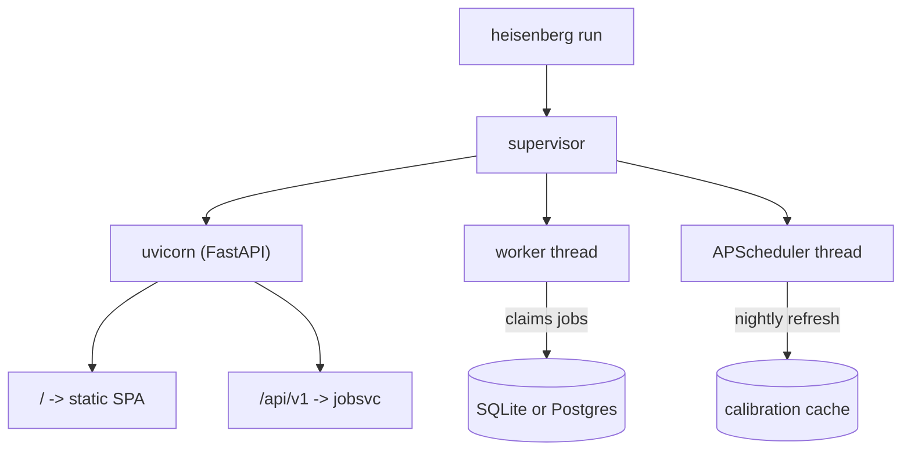

# Operations

How to deploy, monitor, and operate Heisenberg in production.

The platform is conventional web infrastructure assembled around
two quantum-specific seams (cost control on the way in, calibration
refresh on the way back). Most of this section is therefore
boring — and that is the point.

## Deployment shapes

| Shape | Best for | Section |
|-------|----------|---------|
| `heisenberg run` (laptop) | Local dev, demos, single-user. SQLite default. | [Install](install.md) |
| Native systemd | Production servers, single host. | [Native systemd](native_systemd.md) |
| Postgres + multiple replicas | Scale-out production. | [Postgres](postgres.md) |

There is no Docker option. We removed it because the launcher
does the same thing in less rope, and a normal Python install is
what users expect.

## Day-2 operations

| Topic | Section |
|-------|---------|
| Nightly calibration refresh | [Calibration refresh](calibration.md) |
| Provider credentials (IBM, AWS, Azure, ...) | [Provider credentials](credentials.md) |
| Logging, metrics, tracing | [Observability](observability.md) |
| Common problems and fixes | [Troubleshooting](troubleshooting.md) |

## What `heisenberg run` actually does

Single Python process, three threads, one database. `--production`
splits the worker and scheduler into child processes for SIGSEGV
isolation; see [Native systemd](native_systemd.md).

## Critical paths

| Path | Why it matters |
|------|----------------|
| `cost.check_budget` | Rejects over-budget jobs **before** they touch the provider. Skipping this loses money. |
| `auth.deps.get_current_user` | Every authenticated request flows through this. |
| `worker.process_one` | The full compile + submit + persist loop. |
| `calibration.main.refresh_one` | Nightly per-chip atomic JSON write. |

If any of these is unhappy, the system is unhappy.

---

Heisenberg's operations layer was designed and implemented by **Nimesh Cheedella**.
