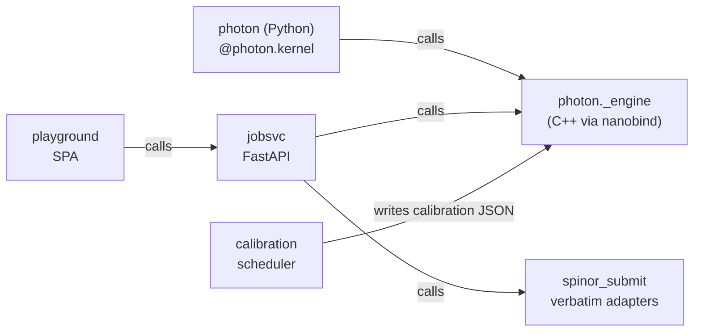

# Packages

Five shipped packages. Each has its own install + reference + cookbook.

-   :material-language-python:{ .lg .middle } **[`photon` (Python)](photon_python/install.md)**

    ---

    The `@photon.kernel` decorator + `photon.QReg` + direct engine
    access. `pip install -e photon/frontends/python`.

-   :material-cloud-upload:{ .lg .middle } **[`spinor_submit`](spinor_submit/install.md)**

    ---

    The Phase A submission adapter: one `submit()` over IBM, AWS,
    Azure, local — verbatim. `pip install -e spinor/submit/python`.

-   :material-server:{ .lg .middle } **[`jobsvc`](jobsvc/install.md)**

    ---

    The Phase D FastAPI service. Persistent jobs, cost control, auth.
    `pip install -e platform/jobsvc`.

-   :material-clock:{ .lg .middle } **[`calibration`](calibration/install.md)**

    ---

    The Phase D nightly refresh service. APScheduler + atomic write.
    `pip install -e platform/calibration`.

-   :material-monitor:{ .lg .middle } **[`playground`](playground/install.md)**

    ---

    The React 19.2 + Monaco SPA. `npm install && npm run build`.

## How they relate

Use `photon` + `spinor_submit` directly if you don't need the API.
Use `jobsvc` + `calibration` + `playground` if you want a multi-user
service with cost control and history.
