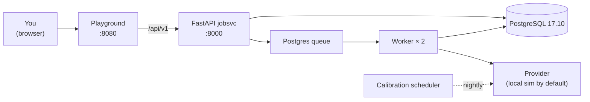

# Quickstart

Five minutes from `git clone` to a histogram in your browser.

## 1. Prerequisites

- Docker + Docker Compose v2
- About 2 GB of free disk for images

That's it. Everything else is in the containers.

## 2. Bring up the stack

```bash
git clone https://github.com/nimesh08/quantum-stack.git
cd quantum-stack/platform/deploy
cp .env.example .env

./run.sh up -d                           # builds db + jobsvc + 2 workers + scheduler + playground
./run.sh smoke                           # waits for /healthz to return 200
```

When `./run.sh smoke` prints `OK`, you're ready.



## 3. Log in

Open <http://localhost:8080> and log in with the seeded admin:

| Field | Value |
|---|---|
| Email | `admin@local` |
| Password | `admin-password` |

(The compose file seeds this on first start. To create more users, see
[admin endpoints](api/rest/index.md#admin) or run
`docker compose exec jobsvc python -m jobsvc.seed me@x.com mypassword`.)

## 4. Click Run

The editor pre-loads with the Bell program:

```
target generic
qubit q[2]
bit c[2]
h q[0]
cx q[0], q[1]
c = measure q
```

Pick `generic` from the target dropdown (it's the default), leave
shots at 1000, click **Run**.

Within ~1 second, the right pane shows:

- A **resource estimate** — `num_qubits: 2`, `two_qubit_count: 1`,
  `depth: 4`, `t_count: 0`.
- A **histogram** — two bars, `00` and `11`, ~50/50.
- The **dollar cost** — `$0.00` because `generic` runs on the local
  simulator.

That's the entire stack: editor → compile → cost-check → queue →
worker → verbatim submission → histogram.

## 5. Try a real chip (cassette mode)

Default `SPINOR_SUBMIT_MODE=cassette` replays recorded provider
responses, so you can target an IBM machine without credentials:

1. In the editor, change the target to `ibm_heron_r2` (Heron r2,
   156 qubits, $0.00033/shot).
2. Submit. The dollar cost shows `$0.330000` for 1000 shots.
3. The histogram comes from
   [`spinor/submit/python/spinor_submit/cassettes/ibm/bell.json`](https://github.com/nimesh08/quantum-stack/blob/main/spinor/submit/python/spinor_submit/cassettes/ibm/bell.json).

For live submissions, set `SPINOR_SUBMIT_MODE=live` and put real
credentials in `.env`. See
[Operations → Live providers](guide/operations.md#live-providers).

## 6. Watch the cost-control seam

Tighten your daily budget so the next IBM run rejects:

```bash
TOKEN=$(curl -s -X POST http://localhost:8000/api/v1/login \
  -H 'Content-Type: application/json' \
  -d '{"email":"admin@local","password":"admin-password"}' | jq -r .access_token)

curl -s -X PATCH -H "Authorization: Bearer $TOKEN" \
     -H 'Content-Type: application/json' \
     -d '{"daily_usd":"0.10"}' \
     http://localhost:8000/api/v1/me/budget
```

Now click **Run** with `ibm_heron_r2` and 1000 shots. You'll see a red
banner:

> **Over budget**: `exceeds_daily_budget`. Cost $0.330000 vs daily
> remaining $0.10.

The job persists with `state=Rejected`. **Nothing was spent.** That's
the first quantum-specific seam — see
[`jobsvc.cost.check_budget`](api/python/jobsvc/cost.md#jobsvc.cost.check_budget).

## What's next

- **Tutorials** —
  [Bell, end to end](tutorial/bell.md),
  [GHZ on a real chip](tutorial/ghz.md),
  [Add a chip in 30 minutes](tutorial/add_a_chip.md).
- **API reference** —
  [REST](api/rest/index.md),
  [Python jobsvc](api/python/jobsvc/index.md),
  [TypeScript playground](api/typescript/index.md).
- **Operations** —
  [Operations guide](guide/operations.md) covers logs, metrics,
  deployment, calibration, and credentials.

## Troubleshooting

| Symptom | Cause / fix |
|---|---|
| `502 Bad Gateway` from the playground | `jobsvc` is still starting; `docker compose logs jobsvc`. |
| Login banner says "invalid credentials" | Compose hadn't seeded yet on first start; `docker compose exec jobsvc python -m jobsvc.seed admin@local admin-password admin`. |
| Histogram never appears | Worker isn't running; `docker compose ps worker`; restart with `docker compose up -d worker`. |
| Over-budget banner you don't expect | `GET /api/v1/me/budget` and `GET /api/v1/jobs?state=Completed` to see what's already counted against today's spend. |
