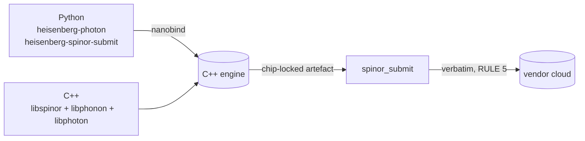

# SDKs

This is the **compiler-side** SDK index. Two ways to drive the
compiler from your code:

- **[C++](cpp/index.md)** — link against `libspinor`, `libphonon`,
  `libphoton`. Use when you embed Heisenberg inside a
  high-performance application or build a custom front-end on top of
  the compiler.
- **Python** — `pip install heisenberg-photon`. Imports as
  `import photon`; provides `@photon.kernel`,
  `compile_phonon(text, target)`, and `photon._engine`. The
  spinor-submit adapters live in a sibling wheel
  (`pip install heisenberg-spinor-submit`); see the
  [auto-generated reference](../reference/python/index.md).

> **Looking for the REST API or the typed TypeScript client?** Those
> live in the platform repo at
> <https://github.com/nimesh08/heisenberg-platform>. The platform
> docs site is at <https://nimesh08.github.io/heisenberg-platform/>.

## Two ways to drive the compiler

The same task — compile a Bell pair to `ibm_heron_r2` and emit
verbatim QASM3 — written in each SDK:

| Task | C++ | Python |
|------|-----|--------|
| Compile from source | `spinorc compile -t ibm_heron_r2 bell.spn` | `photon.compile_phonon(text, target="ibm_heron_r2")` |
| Emit chip-locked QASM3 | `spinorc emit -t ibm_heron_r2 -f qasm3 bell.spn` | `cp = photon.compile_phonon(...); cp.dump_spinor()` |
| Submit verbatim | `spinorc submit -t ibm_heron_r2 --provider ibm bell.qasm3` | `from spinor_submit import submit; submit(qasm, chip, provider, shots)` |

## How the SDKs map to the engine

Both SDKs are doors to the same compiler. RULE 3 (one C++ engine,
one source of truth) is what makes this possible: every language
layer calls into the same engine instead of reimplementing
compilation.

## Conventions every SDK follows

- **Cassette mode by default.** Tests and CI runs replay recorded
  provider responses so no cloud account is needed. Set
  `SPINOR_SUBMIT_MODE=live` to flip every adapter to real-cloud
  submission.
- **Verbatim submission only.** No SDK silently re-transpiles your
  program. The provider runs what the compiler produced (RULE 5).
- **Histograms come back unmodified.** No rescaling, no smoothing.
  Whatever the chip produced.

---

Heisenberg, Spinor, Phonon and Photon were designed and implemented
by **Nimesh Cheedella**.
