# TypeScript SDK — tutorial

We will build a minimal playground from scratch in ~80 lines of
TSX. By the end you have an editor, a target picker, a Run button,
and a live histogram — the same shape as the bundled playground,
but yours to extend.

## What we are building

```mermaid
flowchart LR
  editor[Monaco editor] --> form[useState source]
  picker[<select> chips] --> form
  form --> submit[Submit button]
  submit --> useCreate[useCreateJob mutation]
  useCreate --> useJob[useJob polling hook]
  useJob --> chart[Histogram bar chart]
```



## Step 0 — scaffold a Vite + React 19 app

```bash
npm create vite@latest my-playground -- --template react-ts
cd my-playground
npm install @heisenberg/sdk @tanstack/react-query \
            @monaco-editor/react recharts
```

## Step 1 — the API client

`src/client.ts`:

```ts
import { createClient } from "@heisenberg/sdk";

export const client = createClient({
  baseUrl: import.meta.env.VITE_API_URL ?? "http://127.0.0.1:8080",
  apiKey:  import.meta.env.VITE_HEISENBERG_API_KEY!,
});
```

## Step 2 — the editor

`src/Editor.tsx`:

```tsx
import { Editor as Monaco } from "@monaco-editor/react";

export function Editor({
  value,
  onChange,
}: {
  value: string;
  onChange: (next: string) => void;
}) {
  return (
    <Monaco
      height="40vh"
      defaultLanguage="plaintext"
      value={value}
      onChange={(v) => onChange(v ?? "")}
      theme="vs-dark"
    />
  );
}
```

## Step 3 — target picker

`src/TargetPicker.tsx`:

```tsx
import { useTargets } from "@heisenberg/sdk";
import { client } from "./client";

export function TargetPicker({
  value,
  onChange,
}: {
  value: string;
  onChange: (next: string) => void;
}) {
  const { data, isLoading } = useTargets(client);
  if (isLoading) return <span>loading targets…</span>;
  return (
    <select value={value} onChange={(e) => onChange(e.target.value)}>
      {data!.items.map((t) => (
        <option key={t.id} value={t.id}>
          {t.id} ({t.qubits} qubits, {t.provider})
        </option>
      ))}
    </select>
  );
}
```

## Step 4 — histogram chart

`src/Histogram.tsx`:

```tsx
import { Bar, BarChart, ResponsiveContainer, XAxis, YAxis } from "recharts";

export function Histogram({ counts }: { counts: Record<string, number> }) {
  const data = Object.entries(counts).map(([label, count]) => ({
    label,
    count,
  }));
  return (
    <ResponsiveContainer width="100%" height={300}>
      <BarChart data={data}>
        <XAxis dataKey="label" />
        <YAxis />
        <Bar dataKey="count" />
      </BarChart>
    </ResponsiveContainer>
  );
}
```

## Step 5 — wire it together

`src/App.tsx`:

```tsx
import { useState } from "react";
import { useJob } from "@heisenberg/sdk";
import { client } from "./client";
import { Editor } from "./Editor";
import { TargetPicker } from "./TargetPicker";
import { Histogram } from "./Histogram";

const BELL = `target generic
qubit q[2]
bit c[2]
h q[0]
cx q[0], q[1]
c = measure q
`;

export function App() {
  const [source, setSource] = useState(BELL);
  const [target, setTarget] = useState("ibm_heron_r2");
  const [jobId, setJobId]   = useState<string | null>(null);
  const { data: job }       = useJob(client, jobId);

  async function run() {
    const j = await client.jobs.create({
      source,
      source_kind: "spinor",
      target,
      shots: 1000,
    });
    setJobId(j.id);
  }

  return (
    <main style={{ padding: 24, display: "grid", gap: 16 }}>
      <h1>my heisenberg playground</h1>
      <Editor value={source} onChange={setSource} />
      <div>
        <TargetPicker value={target} onChange={setTarget} />
        <button onClick={run}>Run</button>
      </div>
      {job?.state === "Completed" && (
        <Histogram counts={job.result!.counts} />
      )}
      {job?.state === "Failed" && (
        <p style={{ color: "red" }}>{job.rejection_reason}</p>
      )}
    </main>
  );
}
```

## Step 6 — wrap in QueryClientProvider

`src/main.tsx`:

```tsx
import { QueryClient, QueryClientProvider } from "@tanstack/react-query";
import { createRoot } from "react-dom/client";
import { App } from "./App";

const qc = new QueryClient();
createRoot(document.getElementById("root")!).render(
  <QueryClientProvider client={qc}>
    <App />
  </QueryClientProvider>,
);
```

## Step 7 — run

```bash
heisenberg run --no-browser &              # in another terminal
echo "VITE_HEISENBERG_API_KEY=$KEY" > .env.local
npm run dev
```

Open `http://localhost:5173/`, click **Run**, see the histogram.

## What you have learned

- `@heisenberg/sdk` ships a typed `createClient` plus React Query
  hooks (`useJob`, `useJobs`, `useTargets`, `useEstimate`,
  `useAuth`).
- The hooks handle polling, cache invalidation, and cancellation.
- TypeScript catches schema mistakes at compile time.
- A working playground is ~80 lines.

## Where to next

- [Cookbook](cookbook.md) — auth flow, paging, file uploads,
  cancellation.
- [Reference](../../reference/typescript/index.md) — every export
  and prop type.
- The bundled playground's source:
  [`platform/playground/`](https://github.com/nimesh08/quantum-stack/tree/main/platform/playground).

---

Heisenberg's TypeScript SDK was designed and implemented by **Nimesh Cheedella**.
