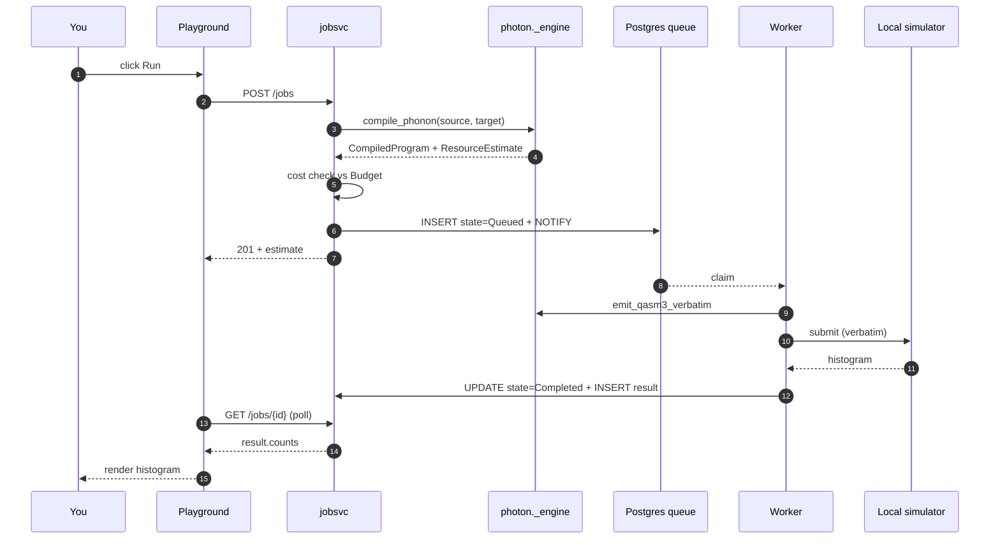

# Bell, end to end

The shortest possible walkthrough — from a freshly-cloned repo to a
histogram in your browser. Five minutes.

## What we're building

The Bell state — two qubits prepared so they always measure together
(`00` or `11`, never `01` or `10`). It's the first program every
quantum textbook starts with, and a perfect end-to-end smoke test:
small enough to run on a local simulator, complex enough to exercise
every layer of the stack.

## 1. Bring up the stack

If you haven't already, follow the [Quickstart](../quickstart.md). At
the end you should have <http://localhost:8080> showing the login page
and `./run.sh smoke` returning `OK`.

## 2. Read the program

```
target generic            # use the portable target — any chip would do
qubit q[2]                # two qubits
bit c[2]                  # two classical bits to catch the measurement
h q[0]                    # Hadamard on qubit 0: |0> -> (|0>+|1>)/sqrt(2)
cx q[0], q[1]             # CNOT: flip q[1] iff q[0] is 1
c = measure q             # collapse both qubits into c
```

After `h q[0]`, qubit 0 is in superposition. After `cx q[0], q[1]`,
the two qubits are entangled — measuring either one fixes the other.

## 3. Submit it via the playground

1. Log in (`admin@local` / `admin-password`).
2. The editor pre-loads the program above.
3. Pick `generic` from the target dropdown.
4. Leave shots = 1000.
5. Click **Run**.

Within ~1 second the right pane shows:

| Field | Value |
|---|---|
| state | `Completed` |
| target | `generic` |
| shots | `1000` |
| qubits | `2` |
| 2-qubit gates | `1` |
| depth | `4` |
| cost | `$0.000000` |

…and a Recharts histogram with two bars, `00` and `11`, each ~500.
Mixed outcomes (`01`, `10`) never appear — that's the entanglement.

## 4. Submit it via the REST API

The playground is a thin client over the same API. Using a JWT:

```bash
TOKEN=$(curl -s -X POST http://localhost:8000/api/v1/login \
  -H 'Content-Type: application/json' \
  -d '{"email":"admin@local","password":"admin-password"}' | jq -r .access_token)

JID=$(curl -s -X POST http://localhost:8000/api/v1/jobs \
  -H "Authorization: Bearer $TOKEN" \
  -H 'Content-Type: application/json' \
  -d '{
        "source": "target generic\nqubit q[2]\nh q[0]\ncx q[0], q[1]\n",
        "source_kind": "spinor",
        "target": "generic",
        "shots": 1000
      }' | jq -r .id)

# Poll until terminal.
while true; do
  STATE=$(curl -s -H "Authorization: Bearer $TOKEN" \
    http://localhost:8000/api/v1/jobs/$JID | jq -r .state)
  echo "$STATE"
  [[ "$STATE" =~ Completed|Failed|Rejected ]] && break
  sleep 1
done

# Show the histogram.
curl -s -H "Authorization: Bearer $TOKEN" \
  http://localhost:8000/api/v1/jobs/$JID | jq .result
```

Output:

```json
{
  "counts": { "00": 498, "11": 502 },
  "shots": 1000
}
```

## 5. Submit it from Python

```python
import os
import time

import httpx


client = httpx.Client(base_url="http://localhost:8000")
tokens = client.post(
    "/api/v1/login",
    json={"email": "admin@local", "password": "admin-password"},
).json()
client.headers["Authorization"] = f"Bearer {tokens['access_token']}"

job = client.post(
    "/api/v1/jobs",
    json={
        "source": "target generic\nqubit q[2]\nh q[0]\ncx q[0], q[1]\n",
        "source_kind": "spinor",
        "target": "generic",
        "shots": 1000,
    },
).json()
print("queued:", job["id"], "estimate:", job["estimate"])

while True:
    j = client.get(f"/api/v1/jobs/{job['id']}").json()
    if j["state"] in ("Completed", "Failed", "Rejected"):
        break
    time.sleep(0.5)

print("histogram:", j["result"]["counts"])
```

## What just happened



Every layer the deep-dives describe was on this path.

## Where to next

- [GHZ on a real chip](ghz.md) — three qubits, a real-ish chip, and
  the cost-control seam.
- [API reference: POST /jobs](../api/rest/index.md) — every parameter
  and status code.
- [Python: `jobsvc.engine.compile_program`](../api/python/jobsvc/engine.md) —
  the function the API calls into.
