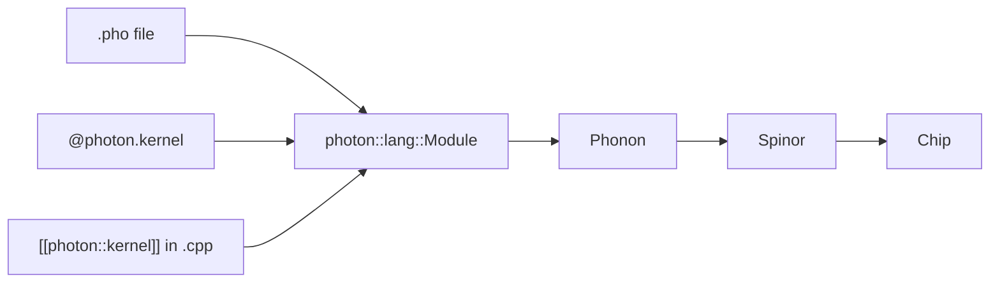

# Photon in 10 minutes

Photon is the OO surface — quantum registers as objects, gates as
methods, algorithms from `photon.lib`. Three frontends (`.pho`,
Python decorator, C++ attribute) all compile to the same engine.

## 1. The shape of a Photon program

```photon
target generic

kernel bell() -> int {
    QReg q(2)
    q.h(0)
    q.cx(0, 1)
    return q.measure_int()
}
```

A kernel is the entry point the platform runs. It allocates a
`QReg`, calls methods on it, and returns an `int` (or `bit[N]`).

## 2. The OO surface — `QReg`

```photon
QReg q(N)                    // N qubits, all in |0⟩
q.h(0)                       // method per Spinor gate
q.cx(0, 1)
q.rz(pi/4, 0)                // continuous rotation
q.swap(0, 2)
q.measure_int()              // measure ALL qubits, pack into int
q.reset(0)                   // chip-permitting
```

Every Spinor gate has a method. Plus three aliases (`hadamard`,
`cnot`, `phase`) for code lifted from textbooks.

## 3. `photon.lib` — the standard library

Seven famous algorithms, callable as one-liners:

```photon
q.bell_pair(a, b)            // h + cx
q.ghz()                      // n-qubit GHZ across the whole register
q.qft()                      // Quantum Fourier Transform
q.iqft()                     // inverse QFT
q.grover(oracle, rounds)     // Grover search
q.teleport(src, anc, dst)    // teleportation
q.vqe_ansatz(depth)          // VQE-style layered ansatz
```

## 4. Control flow

```photon
for i in 0..N {              // bounded, unrolled at compile time
    q.h(i)
}

if (m[0] == 1) {             // feedforward (chip-permitting)
    q.x(1)
}
```

## 5. Three doors, one engine



The same kernel in all three frontends compiles to **identical
Spinor**, enforced by [the convergence test](../languages/photon/rules/three_door_convergence.md).

## 6. From Python

```python
import photon

@photon.kernel
def bell():
    q = photon.QReg(2)
    q.h(0)
    q.cx(0, 1)
    return q.measure_int()

print(bell.compiled.estimate())
print(bell.compiled.dump_spinor())
```

The decorator translates the Python AST to Phonon, then compiles via
the C++ engine. Unsupported Python constructs raise
`UnsupportedConstructError` with a precise diagnostic.

## 7. From C++

```cpp
[[photon::kernel]]
int bell_kernel() {
  QReg q(2);
  q.h(0);
  q.cx(0, 1);
  return q.measure_int();
}
```

Drive with `photonc-cxx build.yaml`. Same compilation backend.

## 8. Worked example: Bell on three chips

```python
@photon.kernel
def bell():
    q = photon.QReg(2)
    q.h(0)
    q.cx(0, 1)
    return q.measure_int()

for chip in ("generic", "ibm_heron_r2", "ionq_forte"):
    p = photon.compile_phonon(bell.phonon_text, target=chip)
    print(chip, p.estimate())
```

| chip | num_qubits | two_qubit_count |
|---|---|---|
| generic | 2 | 1 |
| ibm_heron_r2 | 2 | 1 ECR + 4 single |
| ionq_forte | 2 | 1 MS + 2 single |

## What's next

- [Full Photon reference](../languages/photon/index.md) — every method, every library routine.
- [`@photon.kernel` reference](../languages/photon/reference/frontends/photon_kernel.md) —
  what the Python translator accepts.
- [Cookbook: Bell, three doors](../languages/photon/cookbook/bell_three_doors.md) —
  side-by-side.
